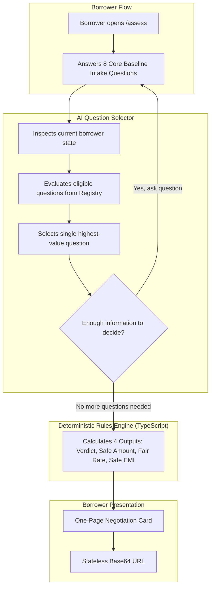
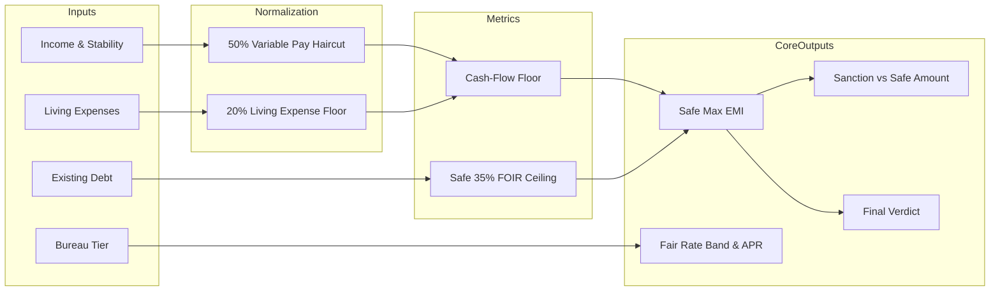

# BorrowIQ

## The Concept: Closing the Information Gap

Every lender uses a credit model to determine what a borrower receives. The borrower enters the branch with nothing. They accept the first sanction letter and often discover years later that they paid 400 basis points over the fair market rate and committed to a loan that consumes 65% of their monthly income.

**BorrowIQ** eliminates that information gap. It is not a credit model; it is a **borrower self-assessment engine** that equips the borrower to negotiate from a position of informed strength.


> **Core Architectural Principle:**  
> BorrowIQ uses AI to decide what information to ask for, but never uses AI to decide what the borrower should borrow.

---

## Clear Separation of Responsibilities



### 1. AI: "What should I ask this borrower next?"
The AI acts as an **adaptive interviewer**. It receives the borrower's current profile, the remaining candidate questions from the **Question Registry**, and the uncertainty in current outputs. It selects the single question with the highest marginal impact to tighten the rate and EMI bands:
* For **Priya** (Salaried engineer, ₹1.1L income, ₹8L wedding loan), the AI prioritizes `variablePayPortionPercent` to haircut bonus volatility and protect the safe EMI ceiling.
* For **Ravi** (Kirana store owner, unencumbered shop, ₹15L business loan), the AI prioritizes `hasUnencumberedCollateral` and `businessVintageYears` to unlock a 9%–10.5% LAP instead of a 16%+ personal loan.
* For **Anita** (Gig delivery rider, ₹28K income, ₹35K app debt), the AI prioritizes `hasHighCostAppLoans` (30%+ instant apps) and `recentDelinquencyOrBounce` to catch debt-spiral risk before sanctioning any new debt.

The AI cannot invent arbitrary questions. It selects strictly from the pre-vetted, type-safe **Question Registry** (`src/lib/questions/registry.ts`).

### 2. Rules Engine: "Given the answers, what are the numbers?"
The core mathematical logic resides in an isolated TypeScript library (`src/lib/rules`). It calculates:
* **The Verdict:** Borrow, Borrow Less, or Do Not Borrow Yet.
* **Maximum Amount:** Two clearly separated figures: what a lender will sanction (using 50%–60% FOIR over 60 months) versus what the borrower can safely carry (using 35% FOIR over 36–48 months).
* **Fair Rate Band:** The rate band the borrower deserves, plus the all-inclusive APR (including processing fees and 18% GST).
* **Safe EMI:** An absolute monthly ceiling anchored to uncommitted cash flow, plus a 20% income-drop stress case.

### 3. UI: "How do I present the question and result?"
The interface uses the Next.js 15 App Router. The quiz renders clean, accessible inputs (choice pills, currency sliders, number steppers) without distracting visual clutter. When the AI selects an adaptive question, the UI displays a clear explanation of why that specific question was prioritized.

### 4. Negotiation Card: "What can the borrower take to the lender?"
The final output is a one-page summary designed for direct use in a branch. The card provides:
* The fair rate band with counter-offer scripts.
* The safe EMI ceiling that the borrower must not cross.
* Product routing guidance (e.g., instructing Ravi to request an MSME Loan Against Property instead of an unsecured personal loan).
* A stateless, Base64-encoded URL hash that allows the borrower to share or bookmark their card with zero server data storage.

---

## Technical Pipeline


---

## Codebase Structure

```
src/
├── app/
│   ├── page.tsx                    # Consumer marketing landing page
│   ├── assess/page.tsx             # Dedicated 2-tier presentation assessment
│   ├── results/page.tsx            # Personal assessment report & quote check
│   ├── card/page.tsx               # Printable official borrower negotiation brief
│   ├── card/[token]/page.tsx       # Stateless URL-shared negotiation brief
│   ├── demo/page.tsx               # Hidden evaluator sandbox (Priya, Ravi, Anita)
│   └── api/select-question/route.ts# Groq openai/gpt-oss-120b underwriter route
├── components/
│   ├── landing/                    # Landing page hero, value props, process, trust
│   ├── quiz/                       # QuizContainer (max-w-4xl) & InputControls
│   ├── results/                    # Bento grid report, stress test, quote checker
│   ├── card/                       # PrintableCard & CardClient
│   └── demo/                       # Live assumption overrides sandbox
└── lib/
    ├── questions/                  # Type-safe Question Registry & AI Selector
    ├── rules/                      # Pure TypeScript deterministic underwriter
    ├── personas.ts                 # Canonical benchmark profiles
    ├── share.ts                    # Stateless URL token compression
    └── types.ts                    # Core TypeScript domain models
```
