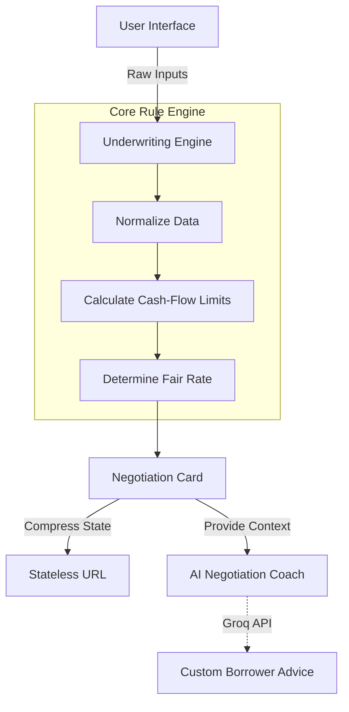
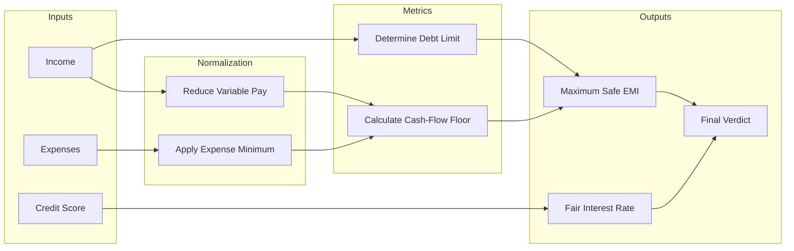

# Borrower Copilot

## The Concept: Closing the Information Gap

Every lender uses a complex credit model to determine what a borrower gets. The borrower enters the branch with nothing. They accept the first sanction letter and often discover years later that they paid 400 basis points over the fair market rate and committed to a loan that consumes 65% of their income.

This application eliminates that information gap. It is not a lender credit model; it is a **borrower self-assessment engine**. It makes the borrower the most informed person in the room.

The borrower answers a short, adaptive sequence of questions and receives a **Negotiation Card**. This card provides four critical data points:
1. **The Verdict:** An objective assessment of whether they should borrow at all.
2. **The Capacity:** The maximum safe amount they can borrow, clearly separated from the inflated amount the lender will try to approve.
3. **The Fair Price:** A specific interest rate band based on their risk profile, including the true annualized cost (APR).
4. **The Limit:** An absolute monthly EMI ceiling anchored to their uncommitted cash flow.

The borrower uses this card to negotiate directly with the lender, ensuring they secure fair terms.

## System Architecture

The application uses a strict separation of concerns to ensure performance, privacy, and mathematical accuracy.



### 1. The Underwriting Rule Engine
The core mathematical logic resides in a pure TypeScript library (`src/lib/rules`). The engine operates entirely independently of the user interface. It normalizes inputs, applies risk haircuts, calculates debt-to-income limits, and routes the borrower to the correct financial product. The application documents every rule, threshold, and limit in the `RULES.md` file.

**Logic Pipeline:**


### 2. Adaptive Client Interface
The application uses the Next.js 15 App Router. The user interface uses React state to create an adaptive decision tree. The application only asks questions that mathematically alter the final assessment. For example, if a salaried worker has an excellent credit score, the application skips questions about business history and loan defaults.

### 3. Stateless Privacy
The application does not use a backend database. It does not store personal data or require user logins. The application processes the entire financial assessment locally in the borrower's browser. When the assessment finishes, the application compresses the mathematical output into a Base64-encoded URL hash. The borrower can share or save this URL, and the application can decode and render the Negotiation Card statelessly on any device.

### 4. AI Negotiation Integration
The application integrates the Vercel AI SDK and the Groq API (Llama 3.3 model). The system securely passes the evaluated assessment parameters to the AI model. The AI operates as a localized negotiation coach. The borrower can ask contextual questions (e.g., "How do I argue if the lender adds a mandatory insurance fee?") and receive immediate, customized advice based on their specific financial profile.

## Local Setup

You can run this application locally in less than five minutes.

### Requirements
* Node.js (version 20 or higher)
* Bun (Optional, but recommended for fast installation)

### 1. Install Dependencies
```bash
bun install
```

### 2. Configure AI (Optional)
To activate the AI negotiation coach, provide a Groq API key in a `.env.local` file at the root of the project:
```text
GROQ_API_KEY=your_groq_api_key_here
```
If you do not provide a key, the application will disable the chat widget, but the core underwriting engine and the Negotiation Card will function perfectly.

### 3. Start the Server
```bash
bun run dev
```
Open http://localhost:3000 in your web browser.
